# Donate Me App

A Flutter-based donation management application built for ICBT 2025 university assignment. This app allows users to make and track donations, manage urgent requests, and facilitate charitable giving.

## Features

- 📱 Cross-platform Flutter application (iOS, Android, Web)
- 🔐 User authentication and profile management
- 💰 Donation tracking and management
- 🚨 Urgent request handling
- 📊 Dashboard with donation statistics
- 🎨 Modern UI with custom widgets
- 🩸 Blood donation registration and tracking
- 💳 Multiple payment methods (Bank Transfer, Online Payment with Stripe)
- 💼 Caregiver job postings and applications
- 📋 User post management with categorized tabs
- ⚙️ Multi-language support (English/Sinhala)
- 📞 Help and support system with FAQ

## Tech Stack

- **Framework**: Flutter (Dart)
- **Backend**: Supabase
- **State Management**: Provider
- **Navigation**: Go Router
- **UI Components**: Custom widgets with Material Design
- **Image Handling**: Image Picker
- **Local Storage**: Shared Preferences

## Getting Started

### Prerequisites

- Flutter SDK (^3.8.1)
- Dart SDK
- Android Studio / VS Code
- Supabase account (for backend services)

### Installation

1. Clone the repository:

```bash
git clone https://github.com/your-username/donate-me-app.git
cd donate-me-app
```

2. Install dependencies:

```bash
flutter pub get
```

3. Set up environment variables:
   - Create a `.env` file in the root directory
   - Add your Supabase credentials:

```
SUPABASE_URL=your_supabase_url
SUPABASE_ANON_KEY=your_supabase_anon_key
```

4. Run the app:

```bash
flutter run
```

## Screenshots

## Screenshots

### Authentication

<div align="center">
  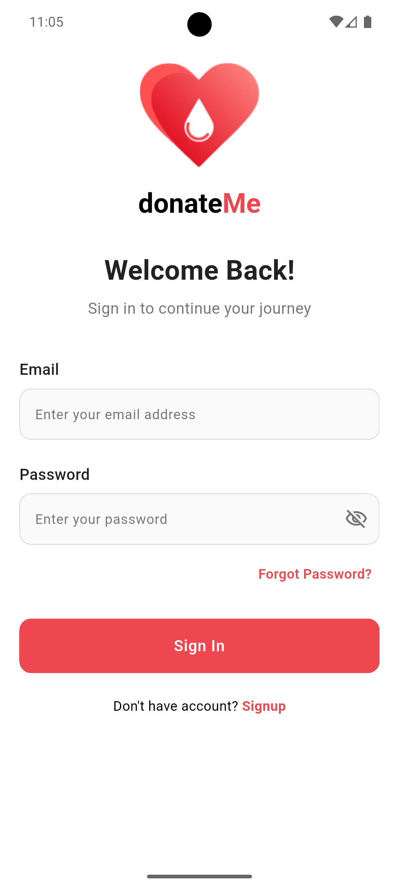
  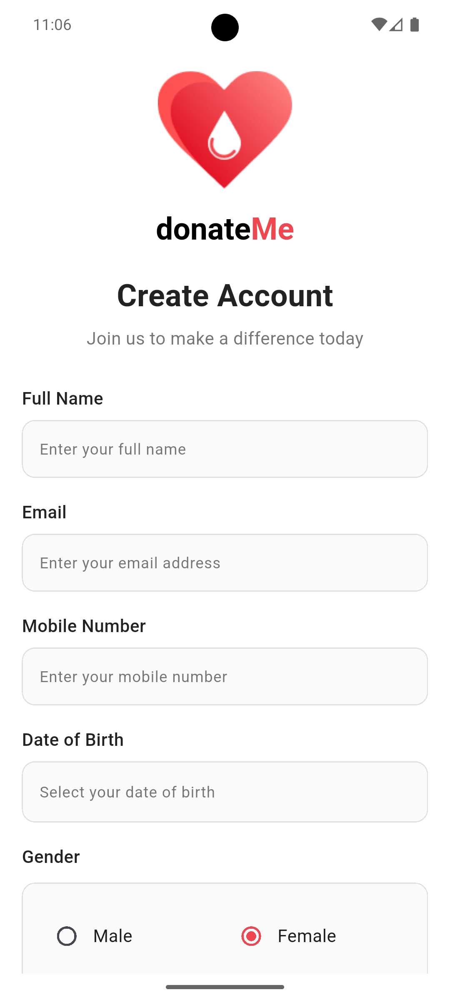
</div>

_Secure user authentication with form validation and error handling_

### Donation Management

<div align="center">  
  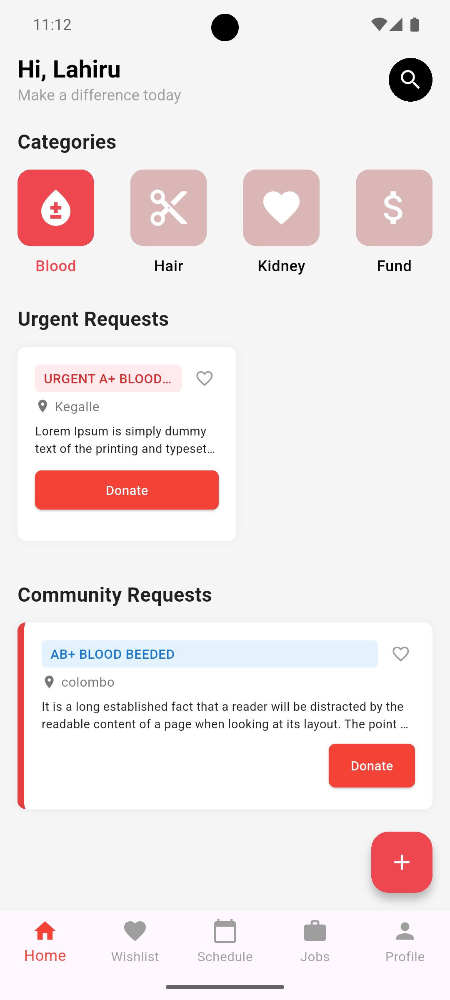
  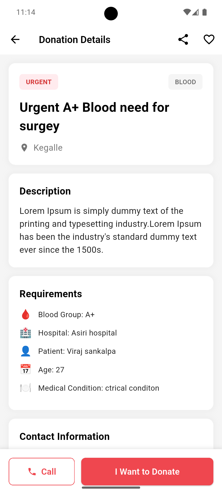
  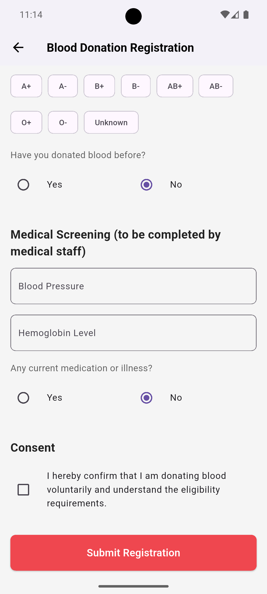
</div>

_Features: Urgent blood requests with detailed requirements, comprehensive medical screening forms, and multiple payment options_

### Payment Processing

<div align="center">
  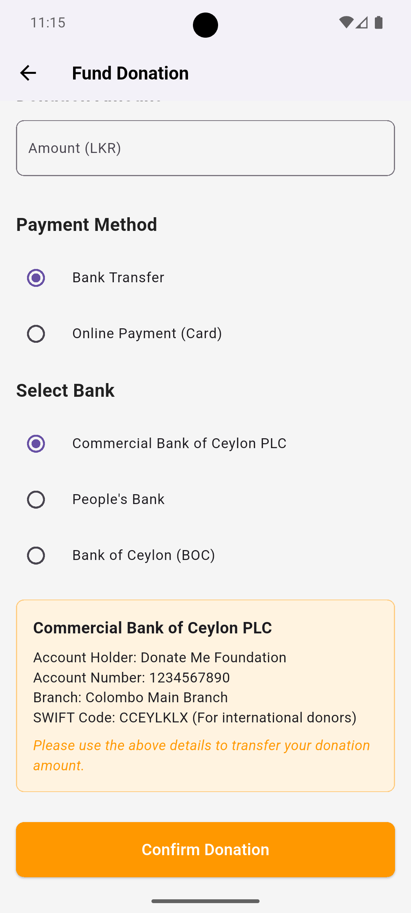
  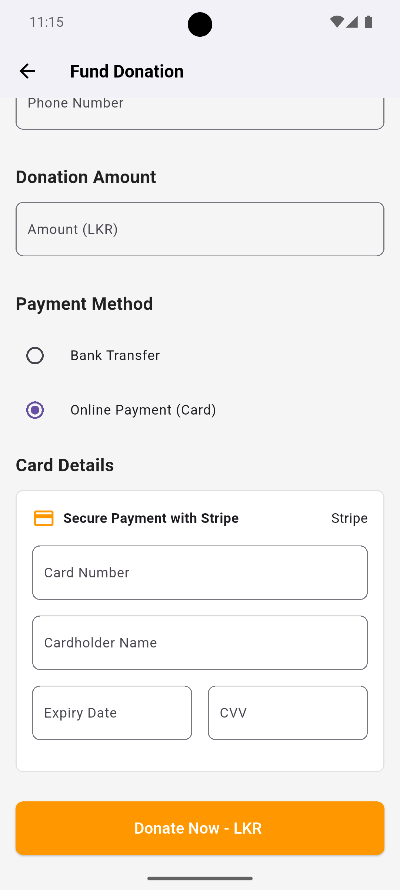
</div>

_Secure online payments with Stripe integration for card transactions_

### User Management & Jobs

<div align="center">
  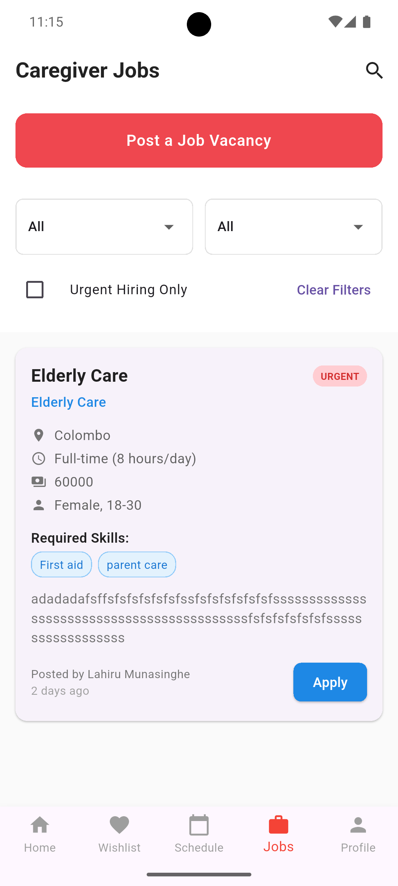
  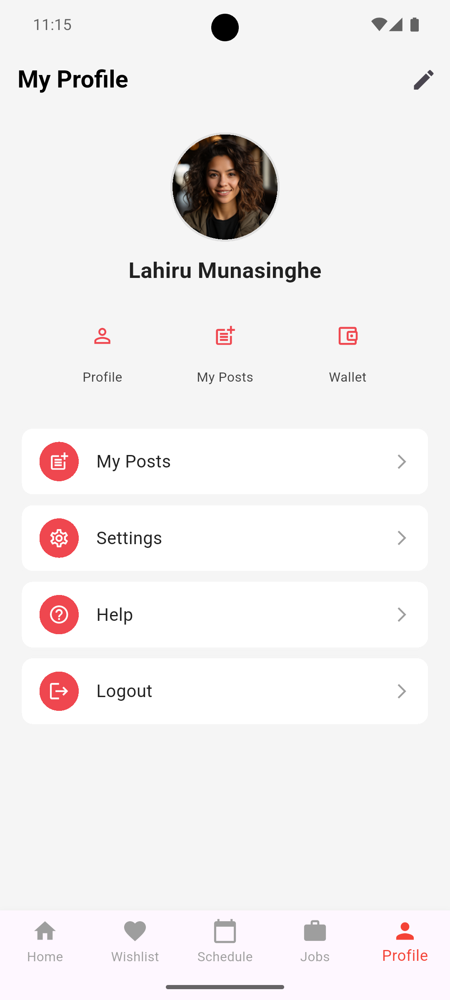
  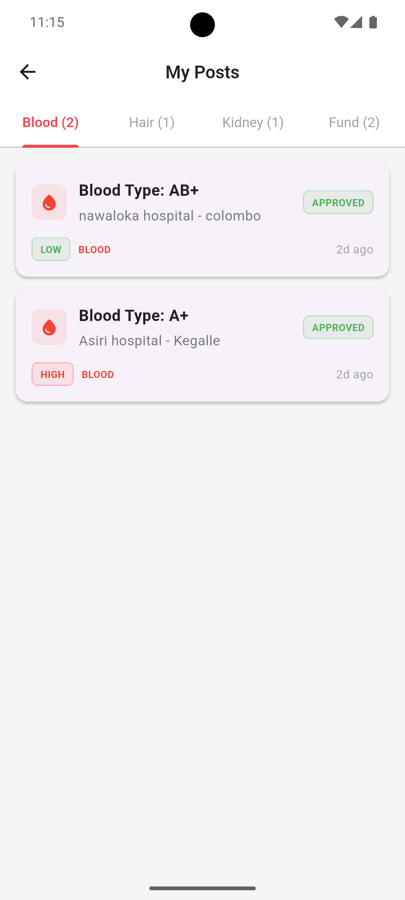
</div>

_Professional job listings for caregivers, comprehensive user profile management, and organized donation post tracking with category tabs_

### Settings & Support

<div align="center">
  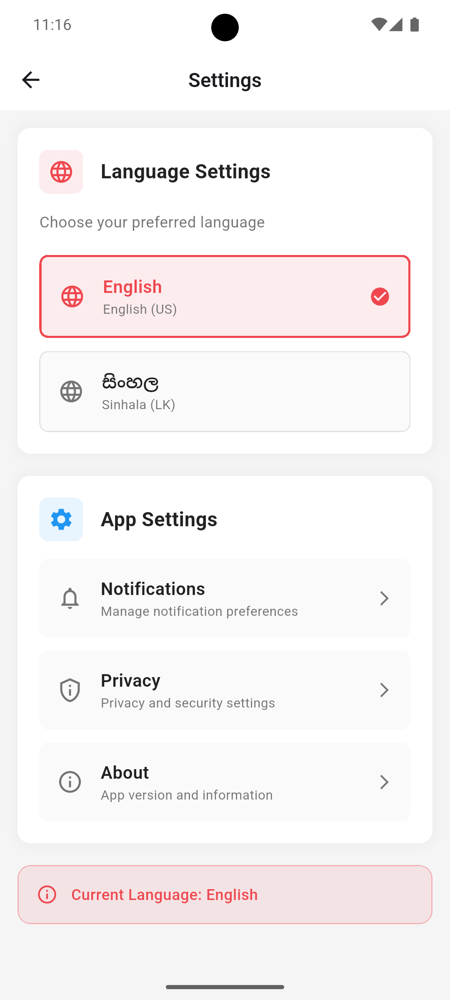
  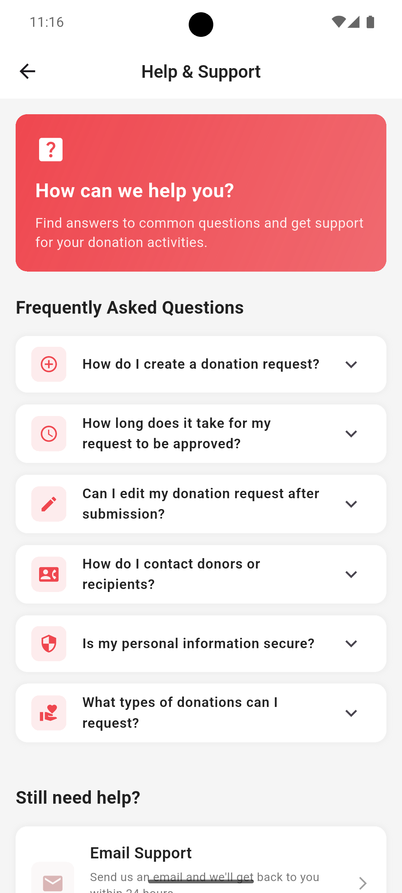
</div>

_Multi-language support with English/Sinhala options and comprehensive help system with expandable FAQ sections_

## Key Features Highlighted in Screenshots

- **🔐 Authentication System**: Secure sign-in and sign-up with form validation
- **🩸 Blood Donation System**: Complete registration process with medical screening
- **💰 Fund Donations**: Secure payment processing with multiple payment methods
- **💼 Job Board**: Caregiver job postings with detailed requirements
- **📱 User Dashboard**: Personal profile and donation history tracking
- **⚙️ Settings**: Language preferences and app configuration
- **🆘 Help System**: FAQ and support contact options

## Project Structure

```
lib/
├── main.dart                 # Application entry point
├── src/
│   ├── common_widgets/      # Reusable UI components
│   ├── constants/           # App constants and configurations
│   ├── features/           # Feature-based modules
│   ├── models/             # Data models
│   ├── providers/          # State management providers
│   ├── router/             # Navigation routing
│   └── services/           # API and backend services
```

## Contributing

This project is part of a university assignment for ICBT 2025. Contributions are welcome for educational purposes.

## License

This project is created for educational purposes as part of ICBT 2025 curriculum.

## Contact

For any questions or support, please contact the development team.
